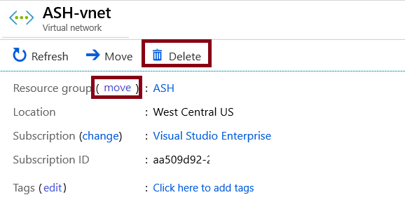

# Removing Azure Resources & Resource Groups

## Warning

- Deleting a resource group deletes everything within it.
- This can have cascading effects if other resources depend on what's being removed.

## Using PowerShell

### Deleting Resource Groups

PowerShell

```
Remove-AzResourceGroup -Name "ContosoRG01" 
```

- **Important:** This command will prompt you for confirmation.

### Deleting Individual Resources

- Example: Deleting a virtual network.
- Alternative: Consider using the 'move' option if the resource needs to be placed elsewhere.
- 