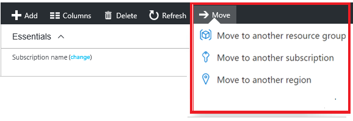

# Reorganizing Azure Resources

## Key Points

- Move resources to new subscriptions or new resource groups within the same subscription.
- **Lock During Move:** Both source and target groups temporarily lock, preventing changes but not disrupting resource availability.
- **Limitations:** Check the "Move operation support for resources page for details on what can be moved and potential restrictions.

## How-To

1. Select the resource group.
2. Choose "Move" button.
3. Select resources and the target group.
4. Acknowledge potential script updates might be needed.
5. 

### Note

Just because a resource can be moved doesn't mean it's without restrictions (e.g., moving a virtual network might require moving dependent resources as well).