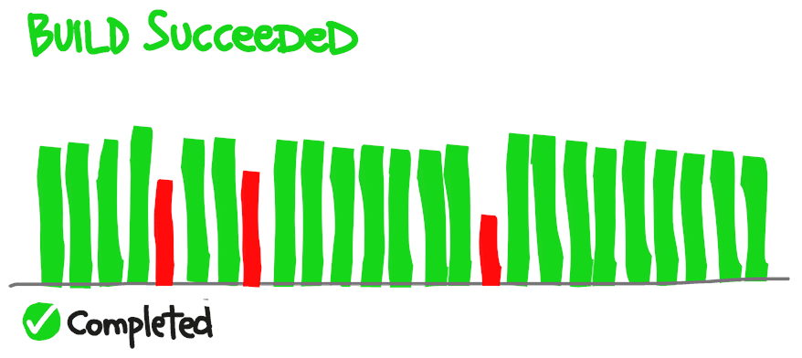
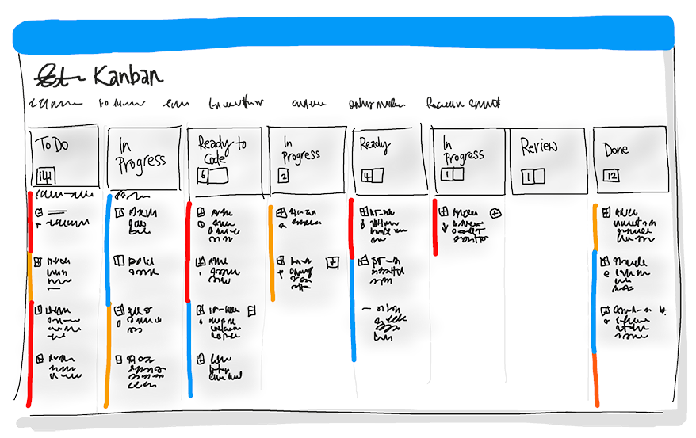
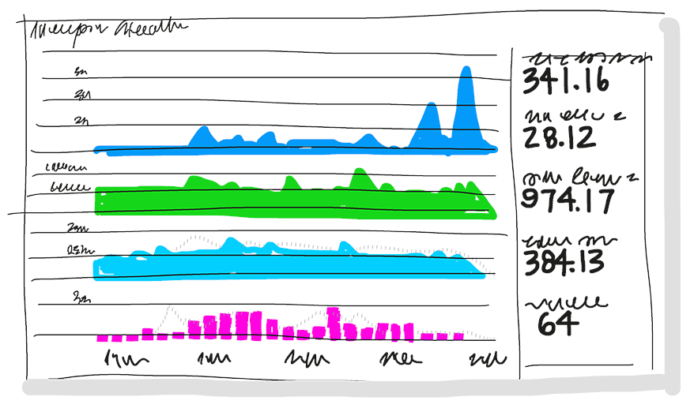
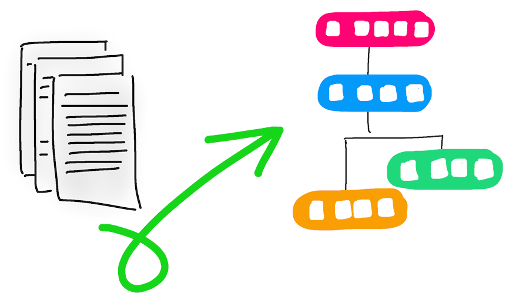
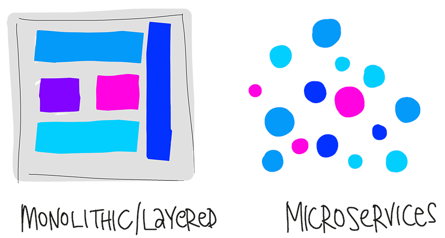
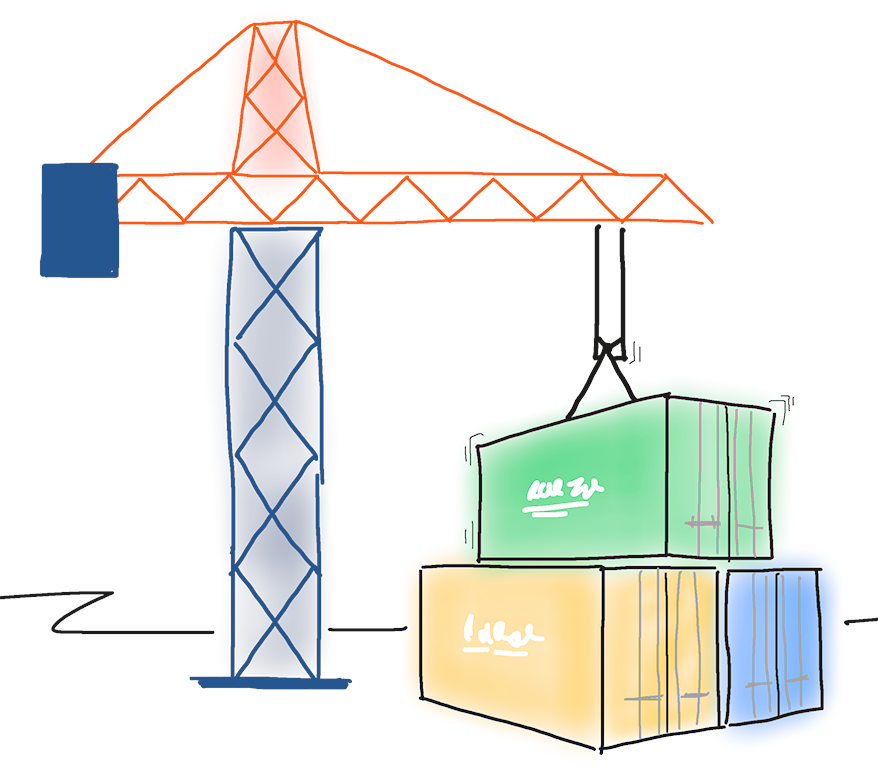
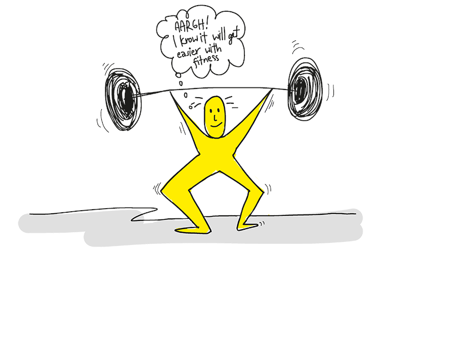

# Shortening Cycle Time for Faster Delivery

- ## Prioritize the Release Pipeline: 
  - Focus on optimizing your deployment process to see the biggest gains. Can you deploy a single line change quickly?
- ## Continuous Integration (CI): 
  - Enables frequent merging and testing to catch defects early, preventing time-consuming merge issues later.
  - 
- ## Continuous Delivery (CD): 
  - Facilitates rapid deployment to testing and production, allowing for fast bug fixes and response to changing needs.
- ## Version Control (Git): 
  - Streamlines collaboration, and integrates with development tools for better tracking.
- ## Agile Planning & Lean Management: 
  - Break work into sprints, adapt quickly to shifting requirements, and define clear "done" criteria for working software.
  - 
- ## Monitoring & Logging: 
  - Track application health and user behavior to form and test hypotheses about improvements quickly.
  - 
- ## Cloud (Public/Hybrid): 
  - Reduce infrastructure bottlenecks in provisioning resources, using IaaS for flexibility or PaaS for higher productivity.
- ## Infrastructure as Code (IaC): 
  - Automate and validate environment setups for consistency and speed.
  - 
- ## Microservices Architecture: 
  - Break down applications into smaller, independently deployable services for better scaling and efficiency.
  - 
- ## Containers: 
  - Faster, lightweight virtualization for application packaging and deployment.
  - 

## Embracing DevOps

- **Expect Initial Discomfort:** Change is hard but becomes easier with practice.
- **Train Consistently:** Focus initially on high-impact practices, then integrate others for greater synergy.
- 