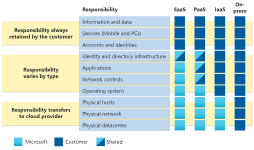

# What is cloud computing

- Cloud computing is the delivery of computing services over the internet. Computing services include common IT infrastructure such as virtual machines, storage, databases, and networking. Cloud services also expand the traditional IT offerings to include things like Internet of Things (IoT), machine learning (ML), and artificial intelligence (AI).

- Because cloud computing uses the internet to deliver these services, it doesn’t have to be constrained by physical infrastructure the same way that a traditional datacenter is. That means if you need to increase your IT infrastructure rapidly, you don’t have to wait to build a new datacenter—you can use the cloud to rapidly expand your IT footprint. [Curled from Microsoft](https://learn.microsoft.com/en-us/training/modules/describe-cloud-compute/3-what-cloud-compute)

## Shared Responsibility Model Overview

#### Comparison with Traditional Datacenter:
- Corporate datacenter:  responsibilities include physical space, security, server maintenance.

- IT department manages infrastructure, software, and system upkeep

#### Shared Responsibilities in Cloud:

- Cloud provider handles physical security, power, cooling, and network connectivity.

- Consumer responsible for data, information, and access security.

#### Varied Responsibilities Based on Situation:

- Example: Cloud provider maintains cloud SQL database, consumer manages data ingestion.

- Consumer is responsible for patches and updates in a virtual machine with an installed SQL database.

#### Responsibility Shift in Cloud Computing:

- On-premises datacenter: Consumer is responsible for everything.

- Cloud computing: Responsibilities shift based on service types (IaaS, PaaS, SaaS)

#### Service Types Impact on Responsibility:
- IaaS places more responsibility on the consumer.

- PaaS distributes responsibility between the cloud provider and consumer.

- SaaS places most responsibility on the cloud provider.

-  [curled from microsoft](https://learn.microsoft.com/)

#### You’ll always be responsible for:

- The information and data stored in the cloud
Devices that are allowed to connect to your cloud (cell phones, computers, and so on).

- The accounts and identities of the people, services, and devices within your organization.

### The cloud provider is always responsible for:

- The physical datacenter

- The physical network

- The physical hosts

#### Your service model will determine responsibility for things like:

- Operating systems

- Network controls

- Applications

- Identity and infrastructure

## Define Cloud Models.

- What are cloud models? The cloud models define the deployment type of cloud resources. The three main cloud models are: private, public, and hybrid.

### What is Private Cloud?
- This is Involves the Evolution from a corporate datacenter, delivering IT services over the internet for a single entity's use.

#### Characteristics:
- Offers greater control for the company and its IT department.

- Greater cost and fewer benefits compared to public cloud deployment.

#### Hosting Options:
- May be hosted on-site in the company's datacenter.

- Alternatively, hosted in a dedicated offsite datacenter, potentially by a third party dedicated to the company.

### What is a Public cloud?
- A public cloud is built, controlled, and maintained by a third-party cloud provider. 

- With a public cloud, anyone that wants to purchase cloud services can access and use resources. 

- The general public availability is a key difference between public and private clouds.

### What is a Hybrid Cloud?
- This is a Computing environment utilizing both public and private clouds interconnectedly.

#### Purpose:
- Allows private cloud to scale for temporary demand using public cloud resources.

- Provides an additional layer of security
#### Flexibility:
- Users can selectively choose services to keep in the public cloud or deploy to their private cloud infrastructure.

#### The following table highlights a few key comparative aspects between the cloud models.

| **Public cloud** | **Private cloud** | **Hybrid cloud** |
| ---- | ---- | ---- |
| No capital expenditures to scale up | Organizations have complete control over resources and security | Provides the most flexibility |
| Applications can be quickly provisioned and deprovisioned | Data is not collocated with other organizations’ data | Organizations determine where to run their applications |
| Organizations pay only for what they use | Hardware must be purchased for startup and maintenance | Organizations control security, compliance, or legal requirements |
| Organizations don’t have complete control over resources and security | Organizations are responsible for hardware maintenance and updates |  |

### What is a Multi-Cloud?
- This Involves using multiple public cloud providers simultaneously.

#### Variety of Use Cases:
- Using different features from various cloud providers.

- Migrating from one provider to another during the cloud journey.

#### Management Challenges:
- Involves dealing with two or more public cloud providers.

- Requires resource and security management in multiple environments.

### What is Azure Arc?
- A Set of technologies for cloud environment management.

#### Scope of Management:
- ##### Manages various cloud environments, including:
  - Public cloud solely on Azure.

  - Private cloud in your datacenter.

  - Hybrid configurations.

  - Multi-cloud environments across multiple providers

#### Functionality:
- Assists in managing and coordinating resources in diverse cloud setups.

### Azure VMware Solution
- What if you’re already established with VMware in a private cloud environment but want to migrate to a public or hybrid cloud? Azure VMware Solution lets you run your VMware workloads in Azure with seamless integration and scalability.

## Expense Types in IT Infrastructure Models:
- ### Capital Expenditure (CapEx):
  - One-time, up-front expenditure for tangible resources.

  - Examples: Building construction, datacenter creation, vehicle purchase.

- ### Operational Expenditure (OpEx):
  - Spending money on services or products over time.

  - Examples: Renting a convention center, leasing a vehicle, using cloud services.

- ### Cloud Computing and OpEx:
  - Operates on a consumption-based model.

  - Payments based on actual usage of IT resources, not fixed infrastructure costs.

- ### Benefits of Consumption-Based Model:
  - No upfront costs.

  - Avoidance of managing costly, underutilized infrastructure.

  - Flexibility to scale resources up or down based on needs.

  - Cost savings by not paying for unnecessary capacity.

- ### Contrast with Traditional Datacenter:
  - Estimating future resource needs crucial.

  - Overestimating leads to wasted spending; underestimating can cause performance issues.

- ### Cloud Model Flexibility:
  - Adjustment of virtual machines based on demand.

  - Paying only for used resources, avoiding costs for unused capacity.

# Summary

## Definition of Cloud Computing:
- Delivery of computing services over the internet
Utilizes a pay-as-you-go pricing model.

## Consumer Benefits:
- Pay only for the used cloud services.

- Facilitates planning and managing operating costs.

- Enhances efficiency in running infrastructure.

- Allows scaling based on changing business needs.

## Analogy to Renting Resources:
- Cloud computing is akin to renting compute power and storage from an external datacenter.

- Treats cloud resources like those in a personal datacenter

## Return of Resources and Billing:
- Resources are given back when no longer in use.

- Billing is based on actual usage, not fixed ownership.

## Responsibility Shift:
- Unlike managing CPUs and storage, the cloud provider maintains the underlying infrastructure.

## Advantages:
- Enables quick solutions to business challenges.

- Allows the adoption of cutting-edge solutions for users.

