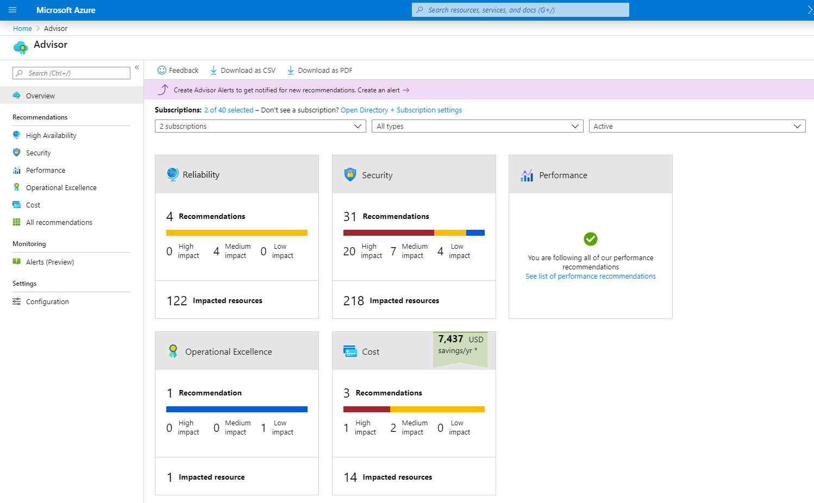

# Azure Advisor: Your Cloud Optimization Assistant

Azure Advisor is a valuable service that analyzes your Azure resource usage and configurations to provide recommendations across five key areas:

- **Reliability:** Ensure your critical applications stay up and running.
- **Security:** Protect your resources from vulnerabilities and threats.
- **Performance:** Boost application speed and responsiveness.
- **Operational Excellence:** Streamline processes, manage resources effectively, and follow deployment best practices.
- **Cost:** Optimize your Azure spending for maximum efficiency.

**Key Features**

- **Personalized recommendations:** Tailored to your specific Azure setup.
- **Actionable steps:** Choose to implement, postpone, or dismiss suggestions.
- **Accessible:** View recommendations through the Azure portal or API.
- **Notifications:** Get alerts about new optimization opportunities.
- **Dashboard:** See an overview of recommendations across all subscriptions.
- **Filtering:** Narrow down recommendations by subscription, resource group, or service.
- 