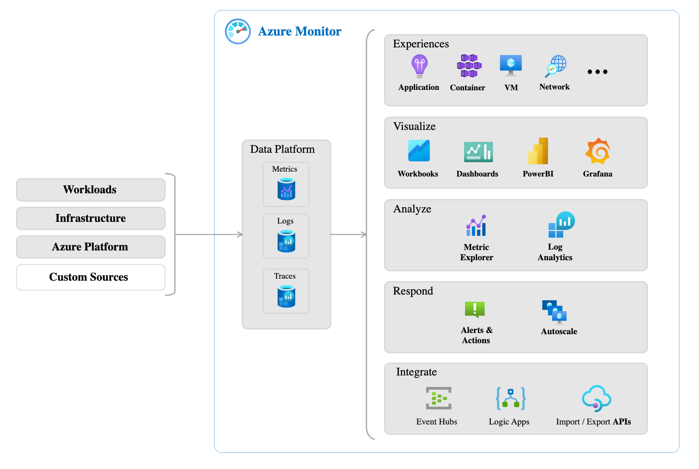
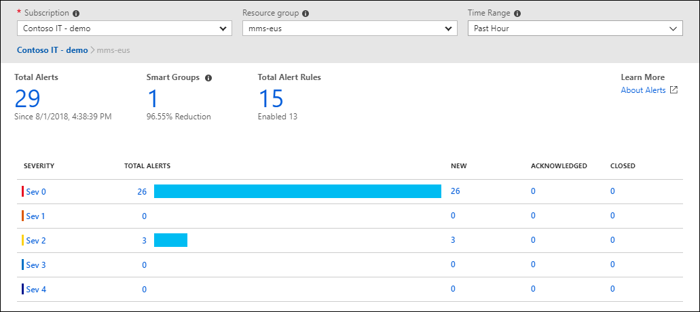

# Azure Monitor: Your Comprehensive Monitoring Solution

Azure Monitor is a powerful platform for collecting, analyzing, visualizing, and acting upon data from Azure resources, on-premises infrastructure, and even multi-cloud environments (like VMs hosted elsewhere).

## Core Components

- **Data Collection:** Azure Monitor gathers a wide range of metrics and logs from various layers of your application architecture:
    - **Application:** Request rates, exceptions, dependencies, etc.
    - **Operating System:** CPU, memory, network usage
    - **Network:** Connectivity, traffic patterns
- **Data Storage:** Metrics and logs are stored centrally for analysis.
- **Insights and Actions:**
    - **Dashboards:** Customizable views in the Azure portal, Power BI, or via Kusto queries offer real-time and historical performance insights tailored to your needs.
    - **Alerts:** Proactive notifications (SMS, email, etc.) triggered by metric thresholds or log events, ensuring you're informed of critical issues.
    - **Autoscaling:** Integration with Azure's autoscaling features allows dynamic resource adjustments based on demand.

## Key Tools

- **Azure Log Analytics:**
    
    - The primary tool in the Azure portal for writing and running log queries.
    - Supports both simple and complex queries, along with data analysis and visualizations.
- **Azure Monitor Alerts:**
    
    - Configurable alerts based on either metrics (near real-time) or complex log-based rules.
    - Alerts trigger actions groups, which define notification preferences (who and how) and potential automated corrective actions.
    - 
- **Application Insights:**
    
    - Specialized for web application monitoring, regardless of hosting location (Azure, on-premises, multi-cloud).
    - Tracks request rates, response times, dependencies, user behavior, exceptions, performance counters, and more.
    - Proactive monitoring using synthetic requests to test application health even during low-traffic periods.

**Key Benefit:** Azure Monitor gives you the visibility and tools to optimize performance, proactively address issues, and automate actions across your entire infrastructure.