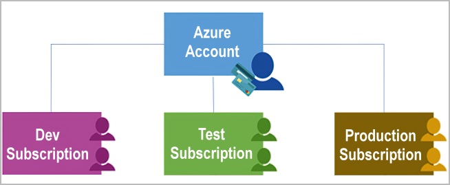
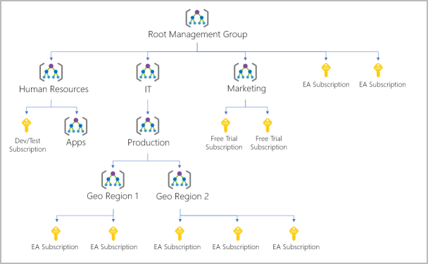

# Azure Infrastructure.

## Azure Physical Infrastructure

- **Foundation:**
  - Built on datacenters, similar in concept to large corporate datacenters
  - Facilities with resources arranged in racks
  - Dedicated power, cooling, and networking infrastructure

- **Global Presence:**
  - Azure operates datacenters worldwide
  - Datacenters grouped into Azure Regions or Azure Availability Zones for resiliency and reliability

- **Accessibility:**
  - Individual datacenters not directly accessible
  - Global infrastructure organized for business-critical workload resiliency

- **Interactive Exploration:**
  - Global infrastructure site offers interactive exploration of the underlying Azure infrastructure

## Azure Regions

- **Definition:**
  - Geographical area on the planet with at least one datacenter, potentially multiple, networked together with low-latency connectivity

- **Resource Assignment:**
  - Azure intelligently manages and assigns resources within each region
  - Ensures appropriate workload balancing

- **Resource Deployment:**
  - When deploying a resource, selection of the region is often required

- **Note:**
  - Some services or VM features are region-specific
  - Global Azure services, like Microsoft Entra ID, Azure Traffic Manager, and Azure DNS, don't require region selection

## Azure Availability Zones

- **Definition:**
  - Physically separate datacenters within an Azure region
  - Each zone comprises one or more datacenters with independent power, cooling, and networking
  - Set up as isolation boundaries, ensuring continuity if one zone experiences issues

- **Minimum Requirement:**
  - A minimum of three separate availability zones in all availability zone-enabled regions for resiliency

- **Resilience Implementation:**
  - Azure provides redundancy and high availability through availability zones
  - Allows co-location of compute, storage, networking, and data resources within and across availability zones

- **Usage and Considerations:**
  - Primarily for VMs, managed disks, load balancers, and SQL databases
  - Three categories of Azure services supporting availability zones: Zonal services, Zone-redundant services, Non-regional services

- **Resilience Beyond Zones:**
  - Despite availability zones, large events may impact multiple zones in a region
  - Azure introduces Region Pairs for additional resilience

## Azure Region Pairs

- **Definition:**
  - Azure regions paired with another region within the same geography, at least 300 miles apart
  - Designed for resource replication across geographies, reducing the risk of interruptions due to events like natural disasters

- **Purpose:**
  - Allows for automatic failover of services to the other region in the pair in case of disruptions in one region
  - Enables reliable services and data redundancy

- **Examples:**
  - West US paired with East US, South-East Asia paired with East Asia

- **Additional Advantages:**
  - Priority restoration of at least one region in a pair during extensive Azure outages
  - Planned updates rolled out to paired regions sequentially to minimize downtime
  - Data remains within the same geography for tax and law-enforcement jurisdiction purposes

- **Important Notes:**
  - Not all Azure services automatically replicate data or fail over between regions
  - Customer configuration may be required for recovery and replication in certain scenarios
  - Most regions are paired bidirectionally, but some, like West India and Brazil South, are unidirectional.

- ### Unidirectional Pairing in Azure Regions

  - **Bidirectional Pairing:**
    - Most Azure regions are paired bidirectionally
    - Each region serves as the backup for the other in the pair (e.g., West US and East US)

  - **Unidirectional Pairing:**
    - Some regions, like West India and Brazil South, are paired unidirectionally
    - In a unidirectional pair, the primary region does not provide backup for its secondary region

  - **Example: West India and South India**
    - West India's secondary region is South India, but South India's secondary region is Central India
    - South India does not rely on West India for backup

  - **Brazil South's Unique Pairing:**
    - Brazil South is uniquely paired with a region outside of its geography
    - Brazil South's secondary region is South Central US, but South Central US's secondary region isn't Brazil South

## Azure Sovereign Regions

- **Definition:**
  - Azure has sovereign regions, isolated instances of Azure for specific purposes.
  - Used for compliance or legal requirements.

- **Examples of Sovereign Regions:**
  - **U.S. Government:**
    - US DoD Central, US Gov Virginia, US Gov Iowa, etc.
    - Isolated instances for U.S. government agencies and partners.
    - Operated by screened U.S. personnel with additional compliance certifications.

  - **China:**
    - China East, China North, etc.
    - Unique partnership with 21Vianet.
    - Microsoft doesn't directly maintain the datacenters.

## Azure management infrastructure

- **The management infrastructure includes Azure resources and resource groups, subscriptions, and accounts. Understanding the hierarchical organization will help you plan your projects and products within Azure.**

## Azure Resources and Resource Groups

- **Resource:**
  - Basic building block of Azure.
  - Examples include Virtual Machines (VMs), virtual networks, databases, cognitive services, etc.

- **Resource Groups:**
  - Groupings of resources in Azure.
  - Each resource must belong to a resource group.
  - A resource can only be in one resource group at a time.
  - Resources within a group share common management tasks and lifecycle.
  - Resource groups cannot be nested.

- **Functionality:**
  - Provides a convenient way to manage and organize resources.
  - Actions applied to a resource group affect all resources within it.
  - Deletion of a resource group deletes all associated resources.
  - Access permissions granted or denied at the resource group level apply to all resources within.

- **Considerations:**
  - No strict rules on resource group usage.
  - Structure based on needs, like grouping for easy deprovisioning or access control.
  - Flexibility in setting up resource groups to maximize utility.

## Azure Subscriptions

- **Definition:**
  - Unit of management, billing, and scale in Azure.
  - Allows logical organization of resource groups and facilitates billing.
  - 

- **Purpose:**
  - Required for accessing Azure products and services.
  - Enables provisioning of resources.
  - Links to an Azure account, serving as an identity in Microsoft Entra ID or a trusted directory.

- **Multiple Subscriptions:**
  - An account can have multiple subscriptions but requires at least one.
  - Enables configuration of different billing models and access-management policies.

- **Subscription Boundaries:**
  - **Billing Boundary:**
    - Determines how an Azure account is billed.
    - Multiple subscriptions for different billing requirements.
    - Separate billing reports and invoices for each subscription.
  
  - **Access Control Boundary:**
    - Azure applies access-management policies at the subscription level.
    - Allows creating separate subscriptions for different organizational structures.
    - Example: Different departments with distinct Azure subscription policies.

## Create Additional Azure Subscriptions

- **Purpose:**
  - Separate resources for function or access management.
  - Enable better organization, access control, and billing management.

- **Examples of Separation:**
  - **Environments:**
    - Set up separate subscriptions for development, testing, security, or compliance.
    - Subscription-level access control enhances security and isolation.
  
  - **Organizational Structures:**
    - Reflect different organizational units with separate subscriptions.
    - Control access and resource provisioning based on organizational roles.
  
  - **Billing:**
    - Manage and track costs effectively by creating separate subscriptions.
    - Aggregate costs based on production, development, testing, or other needs.

## Azure Management Groups

- **Purpose:**
  - Provide a higher level of organization and governance above subscriptions.
  - Enable efficient management of access, policies, and compliance for multiple subscriptions.
  
- **Key Features:**
  - **Hierarchy:** Organize subscriptions into containers called management groups.
  - **Inheritance:** Conditions applied to management groups are automatically inherited by all subscriptions within.
  - **Scalability:** Enable enterprise-grade management at scale, accommodating diverse subscription types.
  - **Nested Structure:** Management groups can be nested to reflect complex organizational hierarchies.

- **Benefits:**
  - Facilitate efficient management and governance for large-scale Azure environments.
  - Streamline access control, policies, and compliance across multiple subscriptions.
  - Ideal for managing multiple applications, development teams, and geographically dispersed resources.

## Management Group, Subscriptions, and Resource Group Hierarchy

- **Flexible Structure:** 
  - Utilize management groups and subscriptions to construct a hierarchical arrangement for efficient organization of resources.
  - This hierarchy facilitates unified policy enforcement and access management.

- **Example Diagram:**
  - A diagram illustrates how management groups are employed to create a governance hierarchy, ensuring centralized management and control.
  

    ### Examples of Using Management Groups

    - **Policy Application:**
      - Establish a hierarchy that enforces specific policies, such as restricting VM locations to the US West Region within a group like "Production." 
      - Policies applied at this level cascade down to all descendant subscriptions, ensuring consistency across all VMs under those subscriptions. 
      - This approach enhances governance by preventing alteration of security policies by resource or subscription owners.

    - **Access Management:**
      - Facilitate user access to multiple subscriptions by consolidating them under a management group.
      - Implement Azure role-based access control (Azure RBAC) assignments at the management group level.
      - Permissions assigned at this level extend to all sub-management groups, subscriptions, resource groups, and resources within the hierarchy.
      - Simplifies access management by enabling users to access all necessary resources without the need for individual RBAC configurations across multiple subscriptions.

    ### Important facts about management groups:

    - 10,000 management groups can be supported in a single directory.
    - A management group tree can support up to six levels of depth. This limit doesn't include the root level or the subscription level.
    - Each management group and subscription can support only one parent.

