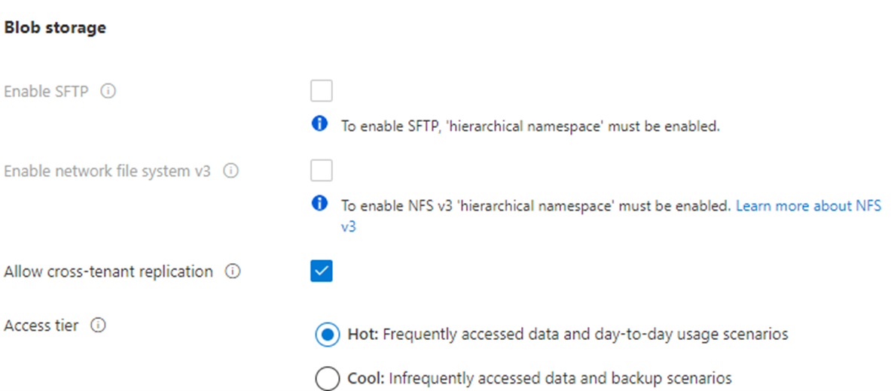
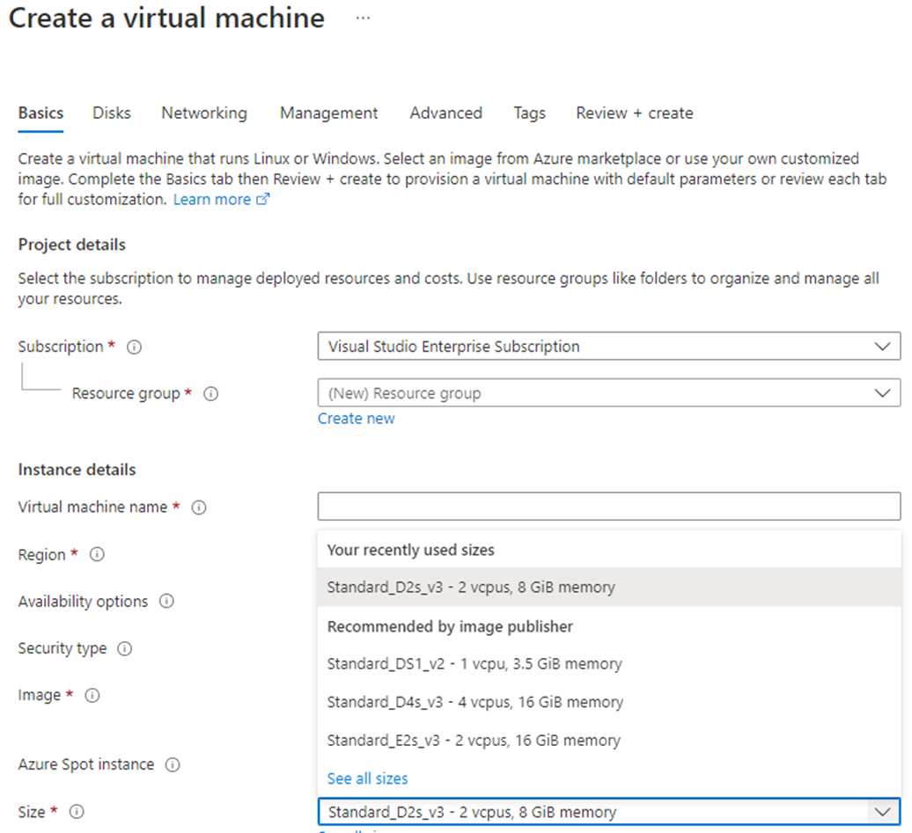

# Azure Costs

- **Azure shifts development costs from the capital expense (CapEx) of building out and maintaining infrastructure and facilities to an operational expense (OpEx) of renting infrastructure as you need it, whether it’s compute, storage, networking, and so on.**

    - That OpEx cost can be impacted by many factors. Some of the impacting factors are:

        - Resource type
        - Consumption
        - Maintenance
        - Geography
        - Subscription type
        - Azure Marketplace

## Factors Affecting Azure Resource Costs:

- ### Resource Type:
  - Various factors impact the cost of Azure resources, including resource type, settings, and region.
  - Metered instances are created for each provisioned resource to track usage and generate usage records for billing.

  - **Examples:**
    - **Storage Account:** Factors such as type (e.g., blob), performance tier, access tier, redundancy settings, and region influence costs.
    - 
  
    - **Virtual Machine (VM):** Considerations include OS/software licensing, processor/cores, attached storage, and network interface.
    - 

## Consumption:

- ### Pay-As-You-Go (PAYG):*
  - Under the PAYG model, you pay for the resources you consume during a billing cycle.
  - Flexibility is a key feature, as usage fluctuations result in corresponding billing adjustments.

- ### Reserved Capacity:
  - Azure offers the option to commit to a predetermined amount of cloud resources in advance.
  - By reserving capacity, users can receive discounts on their resource usage, sometimes up to 72%.
  - This model requires a commitment to using and paying for a specific amount of Azure resources over a defined period (typically one or three years).
  - It provides significant savings for stable workloads while allowing flexibility to accommodate sudden demand surges beyond the reserved capacity.

## Maintenance in the Cloud

- **Flexibility:**
  - Cloud enables rapid resource adjustment based on demand.

- **Resource Organization:**
  - Utilize resource groups for organizing and managing resources efficiently.

- **Cost Control:**
  - Regularly review and deprovision unnecessary resources to control costs.
  - Provisioning and deprovisioning VMs may involve additional resources; ensure timely cleanup.

## Geography in Cloud Deployment

- **Resource Deployment:**
  - Azure allows defining regions for resource deployment, providing global distribution options.
  - Regions can be chosen based on proximity to customers or centralization needs.

- **Cost Variations:**
  - Global deployment leads to pricing differences due to varying costs of power, labor, taxes, and fees.
  - Azure resources may have different deployment costs depending on the region chosen.

- **Network Traffic Impact:**
  - Moving data within a region is less expensive than across continents due to varying network traffic costs.

## Network Traffic and Billing Zones

- **Billing Zones:**
  - Billing zones influence the cost of certain Azure services.
  - Zones are geographical groupings of Azure regions for billing purposes.

- **Bandwidth:**
  - Bandwidth involves data movement in and out of Azure datacenters.
  - Inbound data transfers to Azure are typically free.
  - Outbound data transfers incur costs based on billing zones.

- **Data Transfer Pricing:**
  - Pricing for data ingress, egress, and transfer varies based on billing zones.
  - More details on bandwidth pricing can be found on the bandwidth pricing page.

## Subscription Type and Usage Allowances

- **Azure Subscription Types:**
  - Different Azure subscription types offer varying usage allowances, impacting costs.

- **Example: Azure Free Trial Subscription:**
  - Provides access to several Azure products free for 12 months.
  - Includes credit for spending within the first 30 days of sign-up.
  - Grants access to over 25 always-free products (subject to resource and region availability).

## Azure Marketplace

- **Description:**
  - Azure Marketplace offers Azure-based solutions and services from third-party vendors.
  - Solutions may include preinstalled software, managed network appliances, or connectors to external services.
  - Payment includes Azure services and possibly services or expertise from the vendor, with billing structures determined by the vendor.

- **Certification and Compliance:**
  - All solutions in Azure Marketplace are certified and compliant with Azure policies and standards.
  - Certification policies vary based on solution type and Azure service involved.
  - Additional information on certifications can be found in the Commercial Marketplace certification policies.

