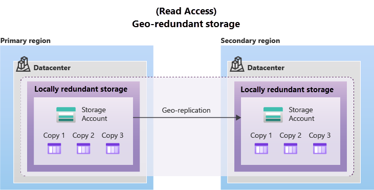

# Azure Storage Redundancy:

- ## Functionality:
  - Azure Storage maintains multiple copies of data to protect against various events like hardware failures and disasters.
  - Redundancy ensures availability and durability targets are met even during failures.

- ## Considerations for Redundancy Options:
  - When selecting a redundancy option, consider the balance between cost and availability.
  - Factors influencing the choice include:
    - Replication strategy in the primary region.
    - Replication to a secondary region for disaster recovery.
    - Need for read access to the replicated data in the secondary region during primary region unavailability.

## Redundancy in the Primary Region:

- ### Replication in the Primary Region:
  - Azure Storage replicates data three times within the primary region for redundancy.
  - **Two options are available for replication**:
    - Locally Redundant Storage (LRS)
    - Zone-Redundant Storage (ZRS)

    - #### Locally redundant storage
        - Locally redundant storage (LRS) replicates your data three times within a single data center in the primary region. 

        - LRS provides at least 11 nines of durability (99.999999999%) of objects over a given year.

        - LRS offers the lowest-cost redundancy option.

        - It provides protection against server rack and drive failures within the primary region.

        - LRS has the least durability among redundancy options.

        - It may not protect against disasters like fire or flooding within the data center.

        - Microsoft recommends considering other redundancy options such as ZRS, GRS, or GZRS to mitigate risks associated with potential disasters.
        - 
    - #### Zone-redundant storage
      - For Availability Zone-enabled Regions, zone-redundant storage (ZRS) replicates your Azure Storage data synchronously across three Azure availability zones in the primary region.

      - ZRS offers durability for Azure Storage data objects of at least 12 nines (99.9999999999%) over a given year.

      - Data remains accessible for both read and write operations even if a zone becomes unavailable.

      - No remounting of Azure file shares from connected clients is needed.

      - Azure performs networking updates like DNS repointing if a zone becomes unavailable.

      - Accessing data before these updates are completed may affect your application.

      - Microsoft suggests using ZRS in the primary region for high availability scenarios.

      - It's also recommended for data governance compliance, restricting data replication within a country or region.
    - #### Redundancy in a secondary region
      - **High Durability:**
        - Data can be copied to a secondary region hundreds of miles away from the primary region for enhanced durability.
        - Ensures data remains accessible even in catastrophic failures preventing primary region data recovery.
      - **Region Selection:**
        - When you create a storage account, you select the primary region for the account. 
        - The paired secondary region is based on Azure Region Pairs, and can't be changed.
      - **Geo-Redundant Storage (GRS):**
        - Similar to running LRS in two regions.
        - Provides redundancy by replicating data to a secondary region.
        - Data in the secondary region isn't accessible by default but can be accessed upon failover.

      - **Geo-Zone-Redundant Storage (GZRS):**
        - Similar to running ZRS in the primary region and LRS in the secondary region.
        - Offers redundancy with ZRS in the primary region and LRS in the secondary region.
        - Secondary region data is not directly accessible until a failover occurs.
      - ### NOTE:
        - *Because data is replicated to the secondary region asynchronously, a failure that affects the primary region may result in data loss if the primary region can't be recovered. The interval between the most recent writes to the primary region and the last write to the secondary region is known as the recovery point objective (RPO). The RPO indicates the point in time to which data can be recovered. Azure Storage typically has an RPO of less than 15 minutes, although there's currently no SLA on how long it takes to replicate data to the secondary region.*
    - #### Geo-redundant storage
      - GRS copies your data synchronously three times within a single physical location in the primary region using LRS. 
      - It then copies your data asynchronously to a single physical location in the secondary region (the region pair) using LRS.
      - GRS offers durability for Azure Storage data objects of at least 16 nines (99.99999999999999%) over a given year.
      - 

