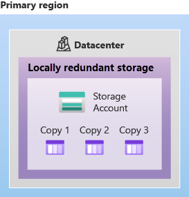

# Azure Storage Redundancy:

- ## Functionality:
  - Azure Storage maintains multiple copies of data to protect against various events like hardware failures and disasters.
  - Redundancy ensures availability and durability targets are met even during failures.

- ## Considerations for Redundancy Options:
  - When selecting a redundancy option, consider the balance between cost and availability.
  - Factors influencing the choice include:
    - Replication strategy in the primary region.
    - Replication to a secondary region for disaster recovery.
    - Need for read access to the replicated data in the secondary region during primary region unavailability.

## Redundancy in the Primary Region:

- ### Replication in the Primary Region:
  - Azure Storage replicates data three times within the primary region for redundancy.
  - **Two options are available for replication**:
    - Locally Redundant Storage (LRS)
    - Zone-Redundant Storage (ZRS)

    - #### Locally redundant storage
        - Locally redundant storage (LRS) replicates your data three times within a single data center in the primary region. 

        - LRS provides at least 11 nines of durability (99.999999999%) of objects over a given year.

        - LRS offers the lowest-cost redundancy option.

        - It provides protection against server rack and drive failures within the primary region.

        - LRS has the least durability among redundancy options.

        - It may not protect against disasters like fire or flooding within the data center.

        - Microsoft recommends considering other redundancy options such as ZRS, GRS, or GZRS to mitigate risks associated with potential disasters.
        - 
    - #### Zone-redundant storage
      - For Availability Zone-enabled Regions, zone-redundant storage (ZRS) replicates your Azure Storage data synchronously across three Azure availability zones in the primary region.

      - ZRS offers durability for Azure Storage data objects of at least 12 nines (99.9999999999%) over a given year.

      - Data remains accessible for both read and write operations even if a zone becomes unavailable.

      - No remounting of Azure file shares from connected clients is needed.

      - Azure performs networking updates like DNS repointing if a zone becomes unavailable.

      - Accessing data before these updates are completed may affect your application.

      - Microsoft suggests using ZRS in the primary region for high availability scenarios.

      - It's also recommended for data governance compliance, restricting data replication within a country or region.

