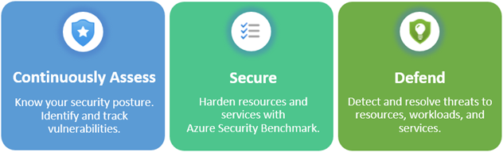
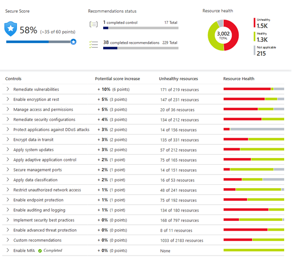

# Microsoft Defender for Cloud

- **Overview:**
  - Monitoring tool for security posture management and threat protection.
  - Monitors cloud, on-premises, hybrid, and multi-cloud environments.
  
- **Key Points:**
  - Provides guidance and notifications to enhance security posture.
  - Offers tools for resource hardening, security posture tracking, and protection against cyber attacks.
  - Easy deployment with native integration to Azure.

## Protection Everywhere with Defender for Cloud

- **Overview:**
  - Defender for Cloud provides security monitoring and protection across various deployment environments.
  - It's seamlessly integrated with Azure services but extends coverage to on-premises datacenters and other cloud environments.

- **Key Points:**
  - Automatically deploys Log Analytics agents to gather security data where needed.
  - Direct deployment for Azure machines; extended coverage for hybrid and multi-cloud environments via Azure Arc.
  - Cloud security posture management (CSPM) features extend to multi-cloud machines without additional agents.

## Azure-Native Protections with Defender for Cloud

- **Overview:**
  - Defender for Cloud provides threat detection and protection across various Azure services and data repositories.

- **Key Protections:**
  - **Azure PaaS Services:** Detects threats targeting Azure services like App Service, Azure SQL, and Storage Account. Offers anomaly detection on Azure activity logs via integration with Microsoft Defender for Cloud Apps.
  - **Azure Data Services:** Automatically classifies data in Azure SQL and provides vulnerability assessments and mitigation recommendations for Azure SQL and Storage services.
  - **Networks:** Helps reduce exposure to brute force attacks by limiting access to virtual machine ports. Utilizes just-in-time VM access and secure access policies for authorized users and source IP addresses.

## Extending Defender for Cloud to Hybrid Cloud Environments

- **Overview:**
  - Defender for Cloud capabilities can be extended to hybrid cloud environments, protecting non-Azure servers.

- **Key Features:**
  - **Customized Threat Intelligence:** Provides tailored threat intelligence and prioritized alerts based on your specific environment.
  - **Integration with Azure Arc:** Enables deployment of Defender for Cloud's enhanced security features to on-premises machines via Azure Arc.

## Extending Defender for Cloud to Other Clouds

- **Overview:**
  - Defender for Cloud can protect resources in other clouds like AWS and GCP.

- **Key Features:**
  - **CSPM Features for AWS:** Assess AWS resources based on AWS-specific security recommendations and compliance standards.
  - **Asset Inventory Management:** Manage AWS resources alongside Azure resources using multi-cloud enabled features.
  - **Container Threat Detection:** Extend container threat detection to Amazon EKS Linux clusters with Microsoft Defender for Containers.
  - **Threat Detection for Servers:** Bring threat detection and advanced defenses to Windows and Linux EC2 instances with Microsoft Defender for Servers.

## Defender for Cloud: Key Functions

- **Assessment:**
  - Continuously assess security posture, tracking vulnerabilities.
- **Security:**
  - Harden resources using Azure Security Benchmark.
- **Defense:**
  - Detect and resolve threats targeting resources, workloads, and services.
- 

    - ### Continuous Assessment

      - Continuously assesses the environment.
      - Includes vulnerability assessment for virtual machines, container registries, and SQL servers.
      - Integration with Microsoft Defender for Endpoint provides access to vulnerability findings.
      - Enables regular, detailed vulnerability scans covering compute, data, and infrastructure.
      - Review and respond to scan results within Defender for Cloud.
    - ### Secure

      - **Security Policies:**
        - Ensure workloads are secure with tailored security policies.
        - Built on Azure Policy controls for flexibility and range.
        - Policies can run on management groups, subscriptions, or the entire tenant.

      - **Continuous Monitoring and Assessment:**
        - Constantly monitors for new resources across workloads.
        - Assesses new resources for security best practices.
        - Provides prioritized recommendations for remediation.

      - **Azure Security Benchmark:**
        - Provides guidelines for security and compliance best practices.
        - Ensures secure configuration standards are applied across resources.

      - **Secure Score:**
        - Groups recommendations into security controls.
        - Assigns a secure score value to each control.
        - Offers an indicator of security posture health.
      - 
    - ### Defend
      - The first two areas were focused on assessing, monitoring, and maintaining your environment. Defender for Cloud also helps you defend your environment by providing security alerts and advanced threat protection features.
      - #### Threat Detection and Response

        - **Security Alerts:**
          - Describe affected resources and provide detailed information.
          - Suggest remediation steps to address the threat.
          - Offer an option to trigger a logic app for automated response.

        - **Alert Management:**
          - Allows export of alerts for further analysis or integration with other tools.
          - Utilizes fusion kill-chain analysis to correlate alerts and understand attack campaigns.
      - #### Advanced Threat Protection

        - **Protected Resources:**
          - Virtual machines, SQL databases, containers, web applications, and network assets.
          
        - **Features:**
          - Just-in-time access for securing management ports of virtual machines.
          - Adaptive application controls to define allowlists for authorized applications.

