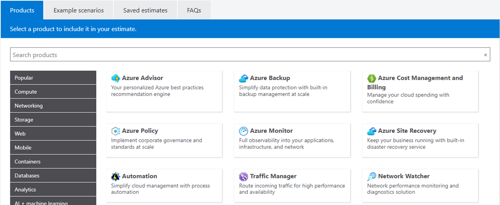
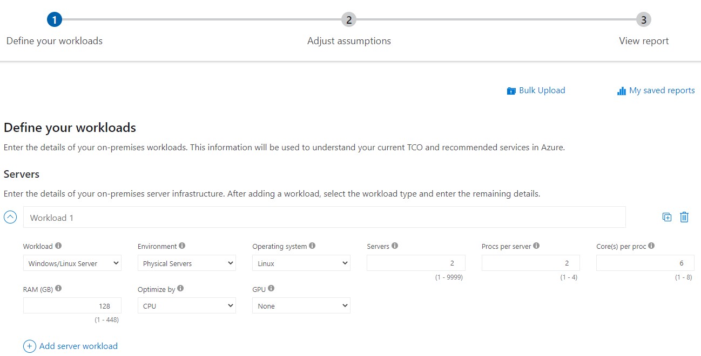

# Azure Pricing and TCO Calculators

- **Description:**
  - Azure provides two calculators: Pricing and TCO.
  - Both are online tools for configuring Azure expenses.

- **Purpose:**
  - **Pricing Calculator:**
    - Estimates costs for specific Azure services.
  - **TCO Calculator:**
    - Assists in understanding total cost of ownership compared to on-premises solutions.

## Pricing Calculator

- **Description:**
  - Estimates costs for provisioning resources in Azure.
  - Provides estimates for individual resources, solutions, or scenarios.
  - Focuses on the cost of provisioned resources.

- **Note:**
  - Estimates are for informational purposes only.
  - No resources are created or charged for.

- **Functionality:**
  - Estimates costs for compute, storage, and network expenses.
  - Allows customization for storage options.
- 

## TCO Calculator

- **Description:**
  - Helps compare costs of on-premises infrastructure to Azure Cloud.
  - Input your current infrastructure configuration.
  - Compares costs of running the same environment in Azure.

- **Functionality:**
  - Enter current infrastructure details.
  - Include assumptions like power and labor costs.
  - Provides cost comparison between on-premises and Azure.
- 

