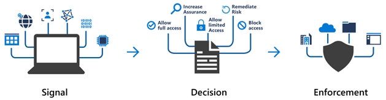

# Conditional Access with Microsoft Entra ID

Conditional Access is a tool used by Microsoft Entra ID to control access to resources based on identity signals, such as user identity, location, and device.

## Benefits:
- **Empowerment:** Allows users to be productive from anywhere and at any time.
- **Protection:** Safeguards organizational assets from unauthorized access.

## Features:
- **Granular Multifactor Authentication:** Offers a more detailed multifactor authentication experience based on user sign-in signals.
- **Dynamic Decision-Making:** Makes access decisions during sign-in based on collected signals, enforcing access control accordingly.
- **The following diagram illustrates this flow:**
  - 

## Conditional Access Use Cases

1. **Multifactor Authentication (MFA) Customization:**
   - Customize MFA requirements based on roles, location, or network.
   - Example: Require MFA for administrators but not regular users or for external connections.

2. **Approved Client Applications:**
   - Limit access to services to only approved client applications.
   - Example: Restrict access to email services to specific email applications.

3. **Managed Device Access:**
   - Allow access to applications only from managed devices meeting security and compliance standards.

4. **Source Trust Verification:**
   - Block access from untrusted sources, like unknown or unexpected locations.

