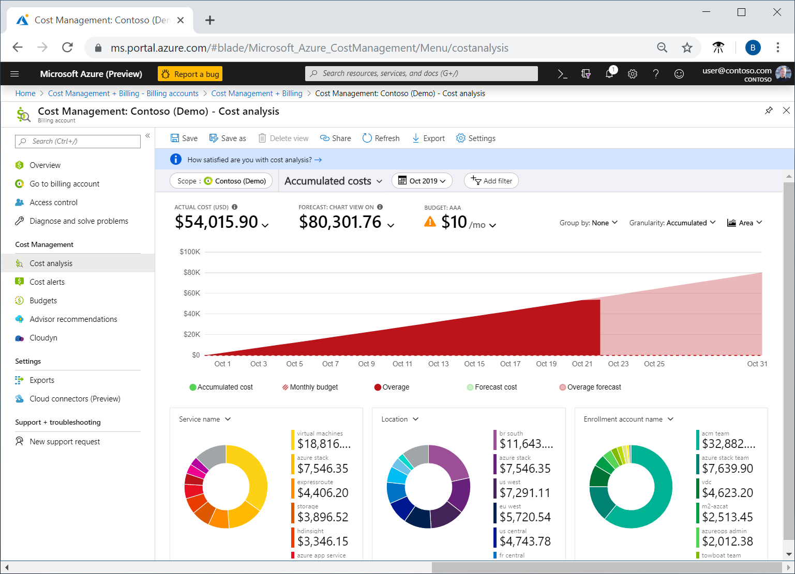

# Microsoft Cost Management tool

- **Description:**
  - Helps monitor and manage Azure resource costs globally.
  - Allows quick checking of Azure resource costs, creating alerts, and setting budgets.

- **Features:**
  - Cost analysis: Provides visual representation of Azure costs.
  - View total costs by billing cycle, region, resource, etc.
- 

- ## Cost Analysis

  - **Description:**
    - Allows exploration and analysis of organizational costs.
    - View aggregated costs by organization to identify spending trends.
    - Track accumulated costs over time to estimate monthly, quarterly, or yearly trends against a budget.
- ## Cost Alerts

  - **Description:**
    - Provides a centralized location to monitor various alert types within the Cost Management service.
    - Includes three main alert types:
      1. Budget alerts
      2. Credit alerts
      3. Department spending quota alerts

- ## Budget Alerts

  - **Description:**
    - Notify when spending, based on usage or cost, reaches or exceeds the defined amount in the budget's alert condition.
    - Budgets are created using the Azure portal or Azure Consumption API.
    - Defined by cost in the Azure portal, or by consumption usage with the Azure Consumption API.
    - Support both cost-based and usage-based budgets.
    - Automatically generated when alert conditions are met.
    - Visible in the Azure portal and sent via email to alert recipients.

- ## Credit Alerts

  - **Description:**
    - Notify when Azure credit monetary commitments are consumed, applicable for organizations with Enterprise Agreements (EAs).
    - Generated automatically at 90% and 100% of Azure credit balance.
    - Alerts appear in cost alerts and are sent via email to account owners.

- ## Department Spending Quota Alerts

  - **Description:**
    - Notify when department spending reaches a fixed threshold of the quota.
    - Quotas configured in the EA portal.
    - Alerts trigger emails to department owners and appear in cost alerts.
    - Thresholds typically set at 50% or 75% of the quota.

## Budgets

- **Description:**
  - Set spending limits for Azure usage.
  - Can be set based on subscription, resource group, service type, or other criteria.
  - Budget alerts triggered when budget hits alert level, appearing in cost alerts.
  - Email notifications sent for triggered budget alerts.
  - Advanced use allows automation based on budget conditions, such as suspending or modifying resources.

