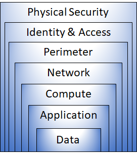

# Defense-in-depth

The objective of defense-in-depth is to protect information and prevent it from being stolen by those who aren't authorized to access it.

A defense-in-depth strategy uses a series of mechanisms to slow the advance of an attack that aims at acquiring unauthorized access to data.

## Layers of defense-in-depth

You can visualize defense-in-depth as a set of layers, with the data to be secured at the center and all the other layers functioning to protect that central data layer.

- **Overview:**
  - Each layer provides protection to prevent further exposure if one layer is breached, slowing down attacks and providing alert information for security teams to act upon.

- **Layers:**
  1. **Physical Security Layer:** Protects computing hardware in the datacenter.
  2. **Identity and Access Layer:** Controls access to infrastructure and change control.
  3. **Perimeter Layer:** Uses DDoS protection to filter large-scale attacks.
  4. **Network Layer:** Limits communication between resources through segmentation and access controls.
  5. **Compute Layer:** Secures access to virtual machines.
  6. **Application Layer:** Ensures applications are secure and free of vulnerabilities.
  7. **Data Layer:** Controls access to business and customer data.

- **Azure's Role:**
  - Azure provides security tools and features at each layer to help make security configuration decisions.

- ## Physical Security

  - **Overview:**
    - First line of defense for securing access to buildings and computing hardware in datacenters.

  - **Key Points:**
    - Provides physical safeguards against unauthorized access.
    - Ensures other security layers can't be bypassed.
- ## Identity and Access

  - **Overview:**
    - Focuses on securing identities, controlling access, and logging sign-in events and changes.

  - **Key Points:**
    - Controls access to infrastructure and change control.
    - Utilizes single sign-on (SSO) and multifactor authentication.
    - Audits events and changes for accountability.
- ## Perimeter

  - **Overview:**
    - Protects against network-based attacks and alerts about malicious activities.

  - **Key Points:**
    - Utilizes DDoS protection to filter large-scale attacks.
    - Employs perimeter firewalls to identify and alert on malicious attacks.
- ## Network

  - **Overview:**
    - Focuses on limiting network connectivity to reduce attack spread.

  - **Key Points:**
    - Limits communication between resources.
    - Adopts a deny-by-default approach.
    - Restricts inbound internet access and limits outbound access as needed.
    - Implements secure connectivity to on-premises networks.
- ## Compute

  - **Overview:**
    - Focuses on securing compute resources and minimizing security issues.

  - **Key Points:**
    - Secures access to virtual machines.
    - Implements endpoint protection on devices.
    - Ensures systems are patched and up-to-date.
- ## Application

  - **Overview:**
    - Focuses on integrating security into the application development lifecycle.

  - **Key Points:**
    - Ensures applications are secure and free of vulnerabilities.
    - Stores sensitive application secrets securely.
    - Makes security a design requirement for all application development.
- ## Data

  - **Overview:**
    - Focuses on securing stored data and controlling access to it.

  - **Key Points:**
    - Ensures proper security measures are in place to maintain confidentiality, integrity, and availability of data.
    - Addresses regulatory requirements related to data security.
    - Protects data stored in various forms such as databases, virtual machines, SaaS applications, and cloud storage.

