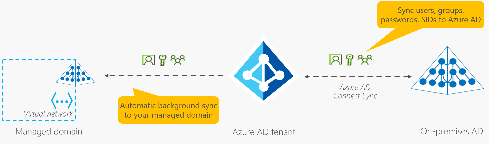

# Microsoft Entra ID:

- Microsoft Entra ID is a directory service facilitating sign-in and access to Microsoft cloud applications and custom cloud applications.
- It integrates with on-premises Active Directory deployments, allowing organizations to manage identity and access centrally.
- While Active Directory on Windows Server manages on-premises identity, Microsoft Entra ID offers cloud-based identity and access management.
- Microsoft Entra ID provides global availability and helps detect suspicious sign-in attempts, enhancing security.
- Integration with Microsoft Entra ID adds security features like monitoring sign-in attempts for unexpected locations or unknown devices.

## Users of Microsoft Entra ID:

- **IT administrators:** Utilize Microsoft Entra ID to manage access to applications and resources as per business requirements.
- **App developers:** Employ Microsoft Entra ID to enhance applications with features like Single Sign-On (SSO) or integration with existing credentials.
- **Users:** Manage their identities and perform maintenance tasks such as self-service password reset.
- **Online service subscribers:** Subscribers of Microsoft 365, Microsoft Office 365, Azure, and Microsoft Dynamics CRM Online authenticate using Microsoft Entra ID.

## Functions of Microsoft Entra ID:

- **Authentication:** Verifies identity for accessing applications and resources. Includes self-service password reset, multifactor authentication, banned password lists, and smart lockout services.
- **Single sign-on (SSO):** Allows users to access multiple applications with a single set of credentials, simplifying the security model and access management.
- **Application management:** Enables management of both cloud and on-premises applications, offering features like Application Proxy, SaaS apps, the My Apps portal, and single sign-on.
- **Device management:** Supports device registration for management via tools like Microsoft Intune, and enables device-based Conditional Access policies to restrict access attempts to known devices.

## Connecting On-Premises AD with Microsoft Entra ID:

- **Maintaining Two Identity Sets:** Initially, if you have both on-premises Active Directory (AD) and Microsoft Entra ID cloud deployment, you would manage two separate identity sets.
- **Integration:** However, you can connect Active Directory with Microsoft Entra ID to achieve a consistent identity experience across both environments.
- **Microsoft Entra Connect:** One method for integration is using Microsoft Entra Connect, which synchronizes user identities between on-premises Active Directory and Microsoft Entra ID.
- **Synchronization:** Microsoft Entra Connect ensures that changes made in one identity system are synchronized with the other, allowing features like single sign-on, multifactor authentication, and self-service password reset to be used seamlessly across both environments.

## Microsoft Entra Domain Services:

- **Managed Domain Services:** Microsoft Entra Domain Services offers managed domain services like domain join, group policy, LDAP, and Kerberos/NTLM authentication.
- **Infrastructure Management:** It eliminates the need to deploy, manage, and patch domain controllers (DCs) in the cloud, providing domain services without infrastructure maintenance.
- **Legacy Application Support:** It enables running legacy applications in the cloud that can't use modern authentication methods or require domain services, allowing seamless migration without relying on on-premises AD DS.
- **Integration with Microsoft Entra Tenant:** It seamlessly integrates with existing Microsoft Entra tenants, enabling users to sign into services and applications using their existing credentials and providing a smoother transition of resources to Azure.

## Microsoft Entra Domain Services:

- **Managed Domain Creation:** Users define a unique namespace (domain name) when creating a managed domain in Microsoft Entra Domain Services.
- **Deployment of Domain Controllers:** Azure automatically deploys two Windows Server domain controllers into the selected Azure region, forming a replica set for redundancy and reliability.
- **Zero Management:** Users are relieved from managing, configuring, or updating these domain controllers as Azure handles all aspects, including backups and encryption at rest using Azure Disk Encryption.

## Synchronization in Microsoft Entra Domain Services:

- **One-Way Synchronization:** Managed domains synchronize information from Microsoft Entra ID to Microsoft Entra Domain Services in a one-way manner. Changes made directly in the managed domain are not synchronized back to Microsoft Entra ID.
- **Hybrid Environment:** In a hybrid environment with an on-premises Active Directory Domain Services (AD DS), Microsoft Entra Connect synchronizes identity information from on-premises AD to Microsoft Entra ID, which is then synchronized to the managed domain.
- **Usage in Azure:** Azure applications, services, and virtual machines (VMs) can utilize common features of Microsoft Entra Domain Services, such as domain join, group policy, LDAP, and Kerberos/NTLM authentication, after connecting to the managed domain.
- 

