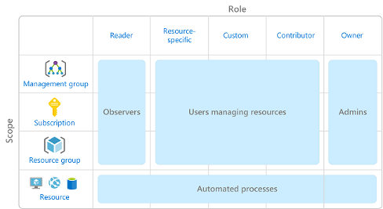

# Role-Based Access Control (RBAC) in Azure

- **Principle of Least Privilege:**
  - Grant access only to the level needed to complete a task.

- **Azure RBAC:**
  - Control access to resources in the cloud environment.
  - Utilize built-in roles or define custom roles with associated access permissions.
  - Assign individuals or groups to roles to grant access permissions.
  - Simplifies access management for teams by automatically applying access rules to new resources and team members.

## How is role-based access control applied to resources?

- **Scope:**
  - Defines the resource or set of resources to which access permissions apply.
  - A management group (a collection of multiple subscriptions).
  - A single subscription.
  - A resource group.
  - A single resource.

- **Roles and Scopes Relationship:**
  - Management groups, subscriptions, or resource groups can be assigned roles.
  - Different roles grant varying levels of control and authority.
  - For example, an owner role provides increased control, while a reader role allows for review or observation without the ability to make updates.
  - 

- **User Roles:**
  - Observers, resource managers, administrators, and automated processes represent typical users or accounts assigned various roles.

- **Hierarchical Structure:**
  - Access permissions granted at a parent scope are inherited by all child scopes.
  - For instance, assigning the Owner role at the management group scope grants management abilities across all subscriptions within the group.
  - Similarly, assigning the Reader role at the subscription scope enables viewing access to all resource groups and resources within the subscription.

## How is Azure RBAC enforced?

  - Azure RBAC governs actions initiated against Azure resources passing through Azure Resource Manager.
  - Resource Manager organizes and secures cloud resources, accessible via the Azure portal, Azure Cloud Shell, PowerShell, and Azure CLI.

- **Model and Permissions:**
  - Azure RBAC operates on an allow model, granting actions within assigned roles.
  - Role assignments stack; if one assignment allows read access and another allows write access to the same resource group, the user has both read and write permissions.