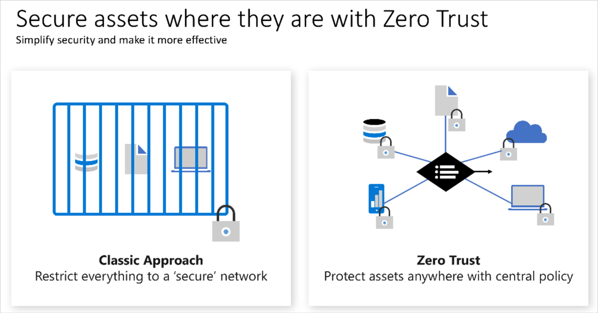

# Zero Trust Security Model

- **Definition:**
  - Zero Trust assumes breach from the outset and verifies each request as though it originated from an uncontrolled network.

- **Rationale:**
  - Adaptation to modern computing complexities, mobile workforce, and diverse resource locations necessitates a new security model.

- **Principles:**
  1. **Verify Explicitly:** Authenticate and authorize based on all available data points.
  2. **Use Least Privilege Access:** Limit user access via Just-In-Time and Just-Enough-Access (JIT/JEA), risk-based adaptive policies, and data protection.
  3. **Assume Breach:** Minimize blast radius, segment access, verify end-to-end encryption, and utilize analytics for visibility, threat detection, and defense improvement.

- **Traditional Approach:**
  - Corporate networks were restricted, protected, and assumed safe. Only managed devices were allowed, VPN access was tightly controlled, and personal devices often restricted.

- **Zero Trust Paradigm:**
  - Assumes breach from any location. Requires authentication for everyone and grants access based on authentication rather than network location.
- 
