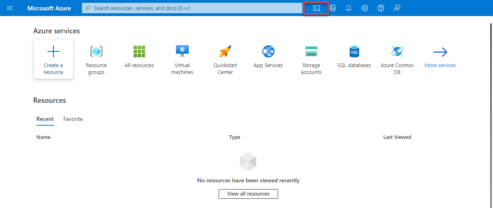

# Ttools for interacting with Azure

- **To get the most out of Azure, you need a way to interact with the Azure environment, the management groups, subscriptions, resource groups, resources, and so on. Azure provides multiple tools for managing your environment, including the:**

    - Azure portal
    - Azure PowerShell
    - Azure Command Line Interface (CLI)

## What is the Azure portal?
- The Azure portal is a web-based, unified console that provides an alternative to command-line tools. With the Azure portal, you can manage your Azure subscription by using a graphical user interface. 

- **You can:**

    - Build, manage, and monitor everything from simple web apps to complex cloud deployments.

    - Create custom dashboards for an organized view of resources.
    - Configure accessibility options for an optimal experience
  - The Azure portal is designed for resiliency and continuous availability. 
  - It maintains a presence in every Azure datacenter. This configuration makes the Azure portal resilient to individual datacenter failures and avoids network slowdowns by being close to users. 
  - The Azure portal updates continuously and requires no downtime for maintenance activities.

## Azure Cloud Shell

- Azure Cloud Shell is a browser-based tool for managing Azure resources using a shell interface. It supports Azure PowerShell and Azure CLI, accessible via the Cloud Shell icon in the Azure portal.
- 

- **Features:**
  - Browser-based shell, no local installation needed.
  - Authenticated with your Azure credentials.
  - Supports Azure PowerShell and Azure CLI.

## What is Azure PowerShell?

Azure PowerShell is a shell with which developers, DevOps, and IT professionals can run commands called command-lets (cmdlets). These commands call the Azure REST API to perform management tasks in Azure. Cmdlets can be run independently to handle one-off changes, or they may be combined to help orchestrate complex actions such as:

- The routine setup, teardown, and maintenance of a single resource or multiple connected resources.
- The deployment of an entire infrastructure, which might contain dozens or hundreds of resources, from imperative code.

Capturing the commands in a script makes the process repeatable and automatable.

In addition to be available via Azure Cloud Shell, you can install and configure Azure PowerShell on Windows, Linux, and Mac platforms.

## What is the Azure CLI?

The Azure CLI is functionally equivalent to Azure PowerShell, with the primary difference being the syntax of commands. While Azure PowerShell uses PowerShell commands, the Azure CLI uses Bash commands.

The Azure CLI provides the same benefits of handling discrete tasks or orchestrating complex operations through code. It’s also installable on Windows, Linux, and Mac platforms, as well as through Azure Cloud Shell.

Due to the similarities in capabilities and access between Azure PowerShell and the Bash based Azure CLI, it mainly comes down to which language you’re most familiar with.