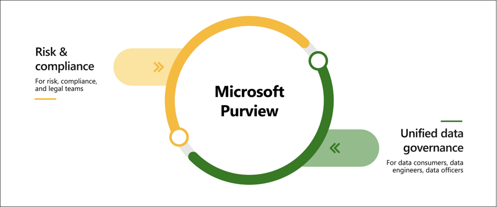

# Microsoft Purview Overview

- **Purpose:** Microsoft Purview offers data governance, risk, and compliance solutions for gaining a unified view of data across on-premises, multicloud, and SaaS environments.

- **Key Features:**
  - Automated data discovery
  - Sensitive data classification
  - End-to-end data lineage

- **Solution Areas:**
  - **Risk and Compliance**
  - **Unified Data Governance**
- 

## Microsoft Purview Risk and Compliance Solutions

- **Core Components:** Microsoft 365 services (e.g., Teams, OneDrive, Exchange)

- **Capabilities:**
  - Protect sensitive data across clouds, apps, and devices.
  - Identify data risks and manage regulatory compliance requirements.
  - Get started with regulatory compliance.

## Unified Data Governance

- **Key Features:**
  - Comprehensive mapping of entire data estate with classification and lineage.
  - Identification of sensitive data storage locations.
  - Establishment of a secure environment for data discovery.
  - Generation of insights into data storage and usage.
  - Secure and scalable management of data access.

- **Supported Data Sources:**
  - Azure, SQL, and Hive databases
  - On-premises, multicloud, and SaaS data
  - Other cloud platforms like Amazon S3

