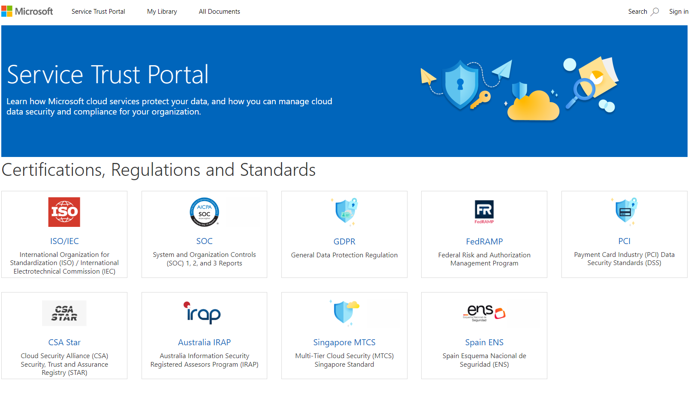

# Microsoft Service Trust Portal Overview

- **Purpose:**
  - Provides access to Microsoft's security, privacy, and compliance practices.
  - Contains details on controls and processes safeguarding cloud services and customer data.

- **Access Requirements:**
  - Sign in with a Microsoft cloud services account (Microsoft Entra organization account).
  - Review and accept the Microsoft non-disclosure agreement for compliance materials.

## Service Trust Portal Main Menu Categories

- **Service Trust Portal:**
  - Quick access hyperlink to return to the portal home page.

- **My Library:**
  - Allows saving and quick access to pinned documents.
  - Option to receive notifications on document updates.

- **All Documents:**
  - Central repository for all documents on the portal.
  - Ability to pin documents for easy access in My Library.
  
- **Note:**
  - Reports and documents remain available for download for at least 12 months after publishing.
